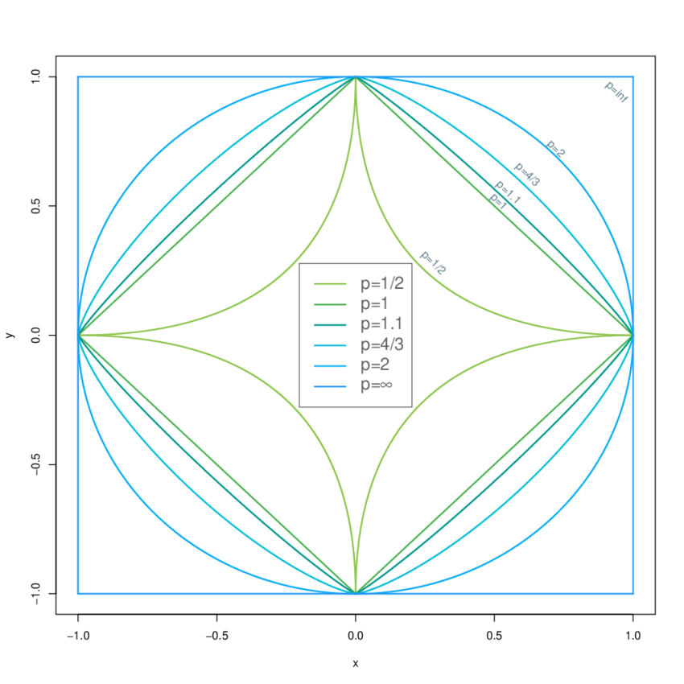

## Intuition
WIP

## Definition
A function $\|\cdot\|: V\to \mathbb{R}$ is a norm if it satisfies the followings:

For arbitrary $\mathbf{x},\mathbf{y}\in V$ and $c \in \mathbb{R}$,

> **(1) Subadditivity:**    $\|\mathbf{x}+\mathbf{y}\| \leq \|\mathbf{x}\| + \|\mathbf{y}\|$
>
> **(2) Absolute homogeneity:**    $c\|\mathbf{x}\| = |c|\|\mathbf{x}\|$
>
> **(3) Positive semidefiniteness:**    $\|\mathbf{x}\|\geq 0; \|\mathbf{x}\| = 0$ if and only if $\mathbf{x}=\mathbf{0}$

## $L^p$-Norms
### Definition
For $\mathbf{x} = (x_1, \cdots, x_n) \in \mathbb{R}^n$, an $L^p$-norm when $1\leq p < \infty$ is defined as:

$$\|\mathbf{x}\|_p := \left( \sum\limits_{i=1}^n |x_i|^p\right)^{1/p}$$

For $p = \infty$, the $L^\infty$-norm is defined as:

$$\|\mathbf{x}\|_\infty := \sup\limits_i |x_i|.$$

For $p=0$, the $L^0$-"norm"[^-1] is defined as:
$$\|\mathbf{x}\|_0 := \text{card}(\mathbf{x}) = \sum\limits_{i=1}^n \mathbb{I}(x_i \neq 0)$$

where

$$\mathbb{I}(x_i \neq 0) :=
\begin{cases}
1 \qquad \text{if}\; x_i \neq 0\\\\
0 \qquad\text{otherwise.}
\end{cases}$$

The $L^2$-norm is also called the Euclidean norm.

## Unit Balls
The set of all vectors with $L^p$-norm less than or equal to $1$,
$$\mathcal{B}_p = \{\mathbf{x} \in \mathbb{R}^n:\|\mathbf{x}\|_p \leq 1 \}$$
is called the unit $L^p$-norm ball.
The following figure shows the shapes of the $\mathcal{B}_p$ balls in $\mathbb{R}^2$ for $p\in \{1/2, 1, 1.1, 4/3, 2, \infty\}$.

[^-1]: This is a slight abuse in the term as $L^0$-"norm" does not satisfy the second property(absolute homogeneity). This is justified as $$\text{card}(\mathbf{x}) = \lim\limits_{p \to 0}\left( \sum\limits_{i=1}^n |x_i|^p\right)^{1/p}.$$